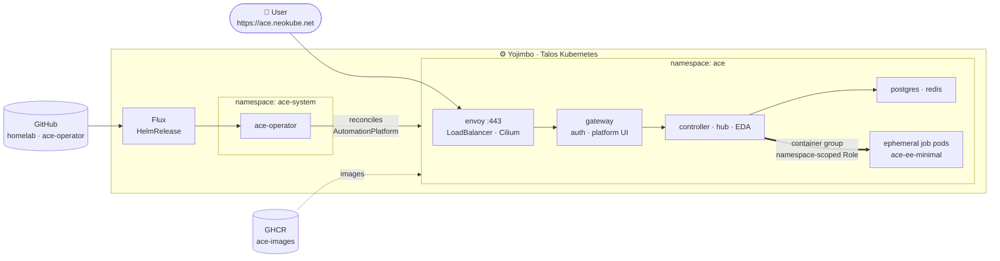

# 🏠 Homelab

## Introduction

This repo contains everything that I built for my homelab.  The purpose of my homelab is to create an environment that I maintain and allows me to expand my knowledge on topics such as: Terraform, Kubernetes and FluxCD.  Terraform is used to automate the whole environment.  In the development environment it configures Kubernetes on k3d and then hands the process over to FluxCD to build out the cluster.  In the UAT and PRD clusters Terraform creates the VM's on Proxmox and provisions Kubernetes on Talos Linux and then also hands the process over to FluxCD.  

By self-hosting a blog on Ghost CMS, it creates a real-world environment that makes me feel responsible for the entire process of deploying and maintaining the application and to think about backup strategies, security, scalability and the ease of deployment and maintenance.

## Cluster Provisioning & Architecture

I use [Talos Linux](https://www.talos.dev/) on Proxmox to set up my clusters. I prefer Talos because it is lightweight, minimal and provides production grade security right out of the box. My installation is completely manged by Terraform which allows me to manage all my Talos clusters across environments.

Below is my current list of Kubernetes Clusters and their functions:

<table>
    <tr>
        <th>Number</th>
        <th>Name</th>
        <th>Description</th>
    </tr>
    <tr>
    <td>1</td>
    <td>Bahamut</td>
        <td>Contains a locally built k3d cluster that is maintained by FluxCD.  It is a place to quickly test new concepts before moving them to Talos Linux</td>
    </tr>
    <tr>
        <td>2</td>
    <td>Yojimbo</td>
        <td>PRD cluster on Talos Linux, built with Terraform on Proxmox.  Treated as a production system with the goal to keeping it running as much as possible.</td>
    </tr>
</table>

## ACE on Kubernetes

[ACE](https://github.com/sammonsjl/ace-operator) — my open-source automation
platform, built from upstream Ansible source — runs entirely on Yojimbo.
[ace-operator](https://github.com/sammonsjl/ace-operator) deploys the whole
platform from a single `AutomationPlatform` resource, and every image it runs is
built by [ace-images](https://github.com/sammonsjl/ace-images) and published to
GHCR.

**How it is deployed.** Flux installs the operator from the Helm chart in the
ace-operator repo itself ([`clusters/yojimbo/ace.yaml`](clusters/yojimbo/ace.yaml)),
so its CRD, RBAC and reconcile code never drift apart. The platform is one
resource, [`apps/yojimbo/ace/platform.yaml`](apps/yojimbo/ace/platform.yaml):
the gateway, controller, hub and EDA, each pinned to an immutable ace-images
tag, plus operator-managed PostgreSQL and Redis. The operator brings the
gateway up first — each component's service secret is issued from inside the
gateway pod — then deploys the components itself; no other operators need to
be installed. envoy takes its own LoadBalancer address, which External DNS
publishes as `ace.neokube.net`.

**How jobs run.** The platform and its jobs share the cluster. The controller
launches each job as an ephemeral pod in the `ace` namespace through a
container group, running the `ace-ee-minimal` execution environment, and the
pod is removed when the job finishes. The controller's ServiceAccount is bound
to a Role scoped to that namespace — pods, their logs and attach, and the
secrets it creates for them — so it cannot reach anything else in the cluster.

**How it is watched.** A ServiceMonitor scrapes the controller's metrics
through the gateway (the component rejects direct calls), and an *ACE Platform*
Grafana dashboard ships beside it in [`apps/yojimbo/ace/`](apps/yojimbo/ace/).

ACE also runs without Kubernetes:
[ace-containerized-installer](https://github.com/sammonsjl/ace-containerized-installer)
installs it as rootless podman containers on one VM, and
[ace-the-hard-way](https://github.com/sammonsjl/ace-the-hard-way) builds it by
hand from source across six.

## :computer: Hardware

### Nodes

I use a mini pc with 64 GB RAM running Proxmox to simulate the compute layer in a cloud environment.  There is also a Synology NAS that simulates the storage layer.  The NAS is used to provision cluster storage using iSCSI and NFS shared volumes depending on the requirements.

## :rocket: Installed Apps & Tools

### Apps

End User Applications
<table>
    <tr>
        <th>Logo</th>
        <th>Name</th>
        <th>Description</th>
    </tr>
    <tr>
        <td></td>
        <td><a href="https://github.com/sammonsjl/ace-operator">ACE</a></td>
        <td>Open-source automation platform built from upstream Ansible source, deployed by ace-operator</td>
    </tr>
    <tr>
        <td></td>
        <td><a href="https://ghost.org/">Ghost CMS</a></td>
        <td>Open Source blogging platform for easily hosting a blog on Kubernetes</td>
    </tr>
    <tr>
        <td></td>
        <td><a href="https://github.com/gethomepage/homepage">Homepage</a></td>
        <td>My customized portal to my homelab & internet</td>
    </tr>
</table>
### Infrastructure

Everything needed to run my cluster & deploy my applications
<table>
    <tr>
        <th>Logo</th>
        <th>Name</th>
        <th>Description</th>
    </tr>
    <tr>
        <td></td>
        <td><a href="https://cert-manager.io/">Cert Manager</a></td>
        <td>X.509 certificate management for Kubernetes.</td>
    </tr>
    <tr>
        <td></td>
        <td><a href="https://cilium.io/">Cilium</a></td>
        <td>My CNI of choice, used on all clusters. eBPF-based Networking, Observability, Security</td>
    </tr>
    <tr>
        <td></td>
        <td><a href="https://developers.cloudflare.com/cloudflare-one/">Cloudflare Zero Trust</a></td>
        <td>Used for private tunnels to expose public services (without requiring a public IP).</td>
    </tr>
    <tr>
        <td></td>
        <td><a href="https://cloudnative-pg.io/">Percona XtraDB Clusater</a></td>
        <td>Database operator for running MySQL clusters</td>
    </tr>
    <tr>
        <td></td>
        <td><a href="https://github.com/kubernetes-sigs/external-dns">External DNS</a></td>
        <td>Synchronizes exposed Kubernetes Services and Ingresses with DNS providers.</td>
    </tr>
    <tr>
        <td></td>
        <td><a href="https://external-secrets.io/latest/">External Secrets Operator</a></td>
        <td>Used to sync my secrets from HashiCorp Vault to my cluster</td>
    </tr>
    <tr>
        <td></td>
        <td><a href="https://fluxcd.io/">Flux CD</a></td>
        <td>My GitOps solution of choice. Better than Argo.</td>
    </tr>
    <tr>
        <td></td>
        <td><a href="https://grafana.com/">Grafana</a></td>
        <td>The open observability platform.</td>
    </tr>
    <tr>
        <td></td>
        <td><a href="https://prometheus.io/">Prometheus</a></td>
        <td>An open-source monitoring system with a dimensional data model, flexible query language, efficient time series database and modern alerting approach.</td>
    </tr>
    <tr>
        <td></td>
        <td><a href="https://github.com/SynologyOpenSource/synology-csi">Synology CSI Driver</a></td>
        <td>Used to provision Persistent Volumes directly on my Synology</td>
    </tr>
    <tr>
        <td></td>
        <td><a href="https://developer.hashicorp.com/terraform">Terraform</a></td>
        <td>Used to Provision Proxmox and Talos using IaC</td>
    </tr>
</table>

## Networking

I use [Cilium](https://cilium.io/) as my CNI. I use LoadBalancer IPAM to assign IP addresses to my LoadBalancer services and use Cilium as an ingress controller. This way, I don't need to install and maintain a separate ingress controller like Traefik or Nginx

### Storage

I use a Synology DS224+ as a NAS. I use the Synology CSI driver to provision Persistent Volumes from my clusters directly on the NAS. I also have an NFS share for data that needs to be shared between clusters.

## Secret Management

Hashicorp Vault is used to store my secrets. I sync them to my cluster using the External Secrets Operator.
